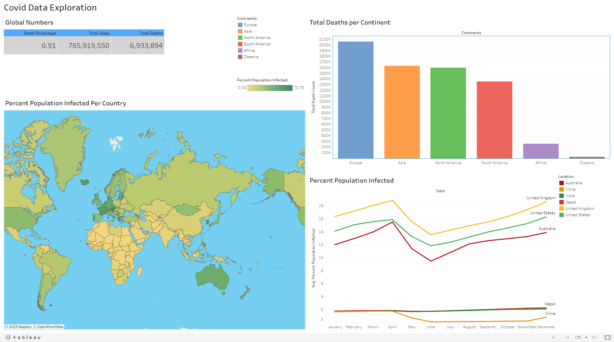

# Covid Data Exploration

## Data Source

The data used in this project is from the [Our World in Data](https://ourworldindata.org/covid-deaths) site which is a scientific online publication that focuses on large global problems such as poverty, disease, hunger, climate change, war, existential risks, and inequality. The data is updated daily and is available in CSV format. The data is also available in JSON format, but for this project, I will be using the excel file to import to the database.

The data is available in the following excel files, which are downloaded from the site mentioned above.

- [COVID-19 deaths](./Covid-deaths.xlsx)
- [COVID-19 vaccinations](./Covid-vaccinations.xlsx)

## Data Exploration

The data exploration is done using the **Microsoft SQL Server Management Studio**. The data is imported into the database and the queries are run to explore the data which are listed in the SQL file [CovidDataExploration.sql](./CovidDataExploration.sql).

## Data Visualization

The data visualization is done using **Tableau**. The data is imported into Tableau and the visualizations are created. The Tableau workbook is available in the file [CovidDataExploration.twbx](./Tableau/Covid%20Data%20Exploration%20Dashboard.twb).

The dashboard is published to Tableau Public and is available at [Covid Data Exploration Dashboard](https://public.tableau.com/views/CovidDataExplorationDashboard_16850145897080/Dashboard1?:language=en-US&:display_count=n&:origin=viz_share_link).

