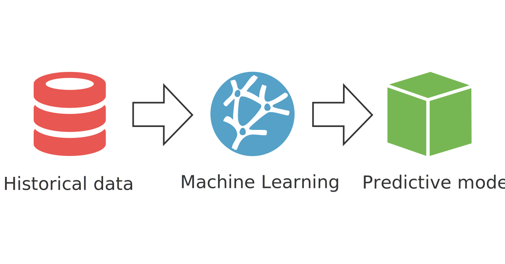

# SALES PREDICTION USING MACHINE LEARNING

## Description

This project aims to predict the sales of a product based on the amount spent on advertising the product. The sales prediction is a regression problem, and I will use the Linear Regression algorithm to solve this problem.

The detailed analysis of the sales prediction can be found in the [Sales Prediction](sales_prediction.ipynb) notebook.

## Sales Prediction

Sales prediction means predicting how much of a product people will buy based on factors such as the amount you spend to advertise your product, the segment of people you advertise for, or the platform you are advertising on about your product.

Typically, a product and service-based business always need their Data Scientist to predict their future sales with every step they take to manipulate the cost of advertising their product. So let’s start the task of sales prediction with machine learning using Python.

## Dataset

The dataset is available in the [advertising](https://www.kaggle.com/datasets/bumba5341/advertisingcsv) from Kaggle, which I have downloaded and saved as [Advertising.csv](Advertising.csv).

## Approach

I will use the [Linear Regression](https://en.wikipedia.org/wiki/Linear_regression) algorithm to predict the sales of a product based on the amount spent on advertising the product.

## Results

The trained model achieved an accuracy of 89.0% and MSE of 1.9919 on the test set, demonstrating its ability to predict the sales of a product based on the amount spent on advertising the product.
